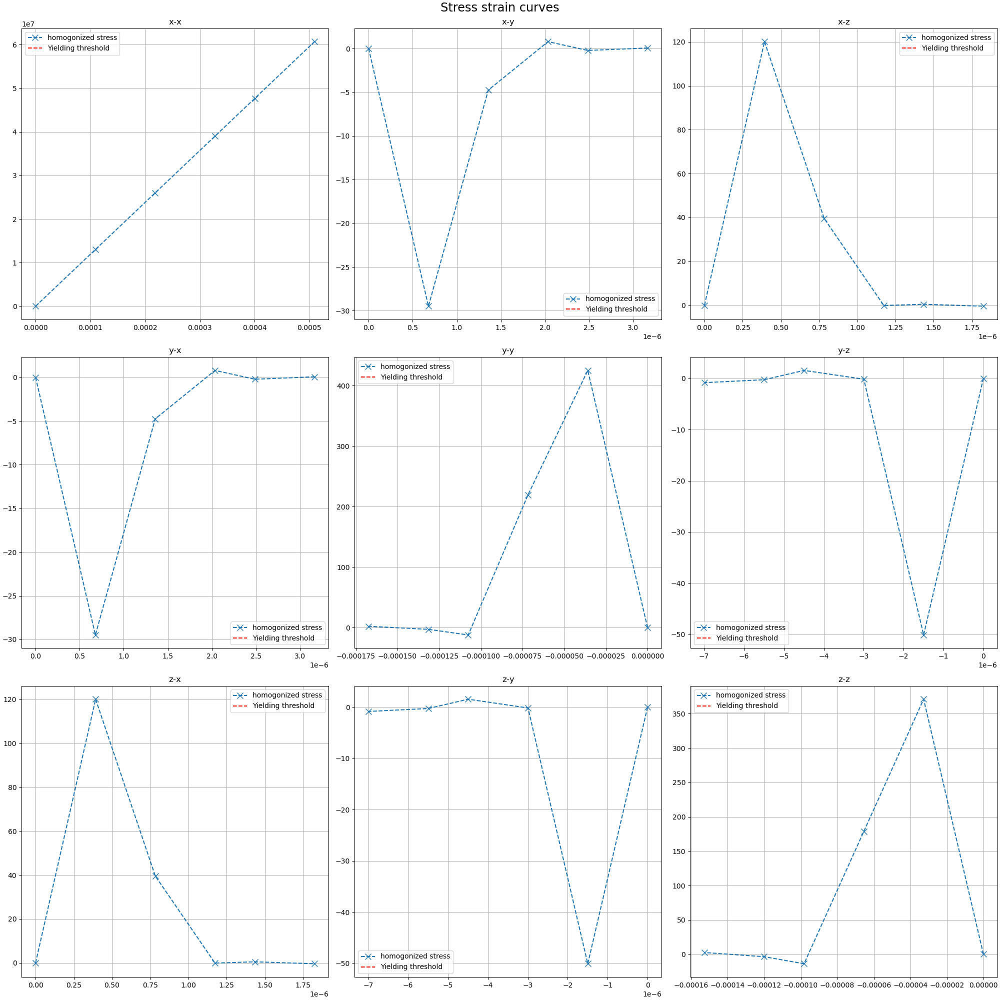

# Example: Finding uniaxial yield points
In this example, it is shown how to find the uniaxial yield point of a material. The steps in this example are more elaborate then the other examples as this example is considered the 'starting point' to show all the features and functionality of the code.

Intentionally, the estimated yield stresses are set too low at first to show the importance of these setting and the need for identifying the values.

- [Example: Finding uniaxial yield points](#example-finding-uniaxial-yield-points)
  - [](#)


The overall steps will be:

1. Create a new project and add nesscecary files
2. Setup the relevant settings in the `problem_definition.yaml`
3. Run the simulation
4. Find the results and adjust settings

For this example, it is assumed that the user provides a grid file named `grid.vti` and a material properties file named `material_properties.yaml`. For this example, a copy of the grid and material properties of the `ExampleProject` will be used.

In this example, it is assumed that the most basic `GNU/Linux` console is used, so for creating a directory the command `mkdir` is used and for editing text `nano` is used. However, any other way of doing these tasks like using a graphical interface in equally valid.

The `root folder` is the folder the `Homogenization_for_DAMASK` folder.

## Create a new project and add nesscecary files
Creating a project can be done by creating a new folder inside of the projects folder (found in the root folder).
```
cd projects # Go into the projects folder

mkdir yield_point_test # Make a project folder

cd yield_point_test # Go into the project folder
```

For a clean working environment, the grid and material properties files will be placed in a separate folder, this is not strictly nesscecary. 
```
mkdir input_files # Create a folder for the input files

## Add the grid.vti and material_properties.yaml to this folder.
```
## Setup the relevant settings in the `problem_definition.yaml`
With the project folder created, the problem definition can be defined. This file always needs to contain the sections `general`, `yielding_condition` and `solver`. As we are in this case going to run a `yield_point` simulation, the `yield_point` needs to be added as well. 

How each section needs to be formatted and what values can be entered is documented in the [`Problem definition manual`](../problem_definition.md). For this example, a pre-configured `problem_definition.yaml` will be used from the `ExampleProject` where most of the comments have been removed for clarity.

**Make the problem_definition.yaml**
```
# Make sure you are in the yield_point_test folder.

nano problem_definition.yaml

# 1. Paste the contents of the problem_definition given below (to paste inside of a console use 'ctrl+shift+v').
# 2. press `ctrl+x`, then `y` to save the file and finally `enter` to confirm the filename
```
Contents of the problem_definition.yaml to copy:
```
general: 

    simulation_type     : yield_point
    remove_damask_files_after_job_completion: True
    dimensions          : 3D
    material_properties : "input_files/material_properties.yaml"
    grid_file           : "input_files/grid.vti"
    dimensions_file     : ''
    stress_tensor_type: "Cauchy"
    strain_tensor_type: "true_strain"
    reduce_parasitic_stresses : False

yielding_condition:
    yield_condition: stress_strain_curve
    plastic_strain_yield: 0.002
    modulus_degradation_percentage: 0.15
    estimated_tensile_yield: 65e6
    estimated_shear_yield: 35e6

solver:
    N_increments: 15
    cpu_cores: 0
    # The following settings are technical DAMASK settings
    stop_after_subsequent_parsing_errors: 20
    solver_type: "spectral_basic"
    N_staggered_iter_max: 10      
    N_cutback_max: 3        
    N_iter_min: 1            
    N_iter_max: 100         
    eps_abs_div_P: 1.0e-4            
    eps_rel_div_P: 5.0e-4            
    eps_abs_P: 1.0e3                  
    eps_rel_P: 1.0e-3                 
    eps_abs_curl_F: 1.0e-10          
    eps_rel_curl_F: 5.0e-4           

    simulation_time : 1000         
    monitor_update_cycle: 5     


yield_point:
    load_direction: ['x-x', 'x-y']
```
If another name or folder for the `grid` or `material properties` is used, be sure to adjust these in the `material_properties` and `grid_file` entries.

These are some important settings that have been put into the `problem_definition.yaml`:

The simulation type is setup to be a uniaxial yield point test:

1. `simulation_type`     : yield_point 

For the definition of yielding, the plastic deformation of 0.2% is used:

2. `yield_condition` : stress_strain_curve
3. `plastic_strain_yield`: 0.002

The number of increments that are taken towards the final stress state is 15:

4. `N_increments`: 15

The DAMASK default number of CPU cores is used (set to this to 4 if DAMASK is giving errors):

5. `cpu_cores`: 0

The yield point will be identified in the normal `x-x` direction and the shear `x-y` direction:

6. `load_direction`: ['x-x', 'x-y']

The last important settings are `estimated_tensile_yield` and `estimated_shear_yield`. These are now intentionally set too low (65 MPa and 35 MPa respectively). This is to show what the effect is when these are set too low and adjusting these will be part of the example.

## Run the simulation
Now the grid, material properties and problem definition are setup, the simulation can be run. Go back to the `root folder` if not already there:
```
# If not already in the root folder (currently in 'yield_point_test'):
cd ../..
```
To run the project, run the following command. It might be needed to activate the a Conda environment first:
```
# If a Conda environment is used, activate this first:
conda activate [environment_name]

# If you have used a different name then 'yield_point_test', adjust the last value!
python run_project.py yield_point_test
```
At this point a summary of the simulation tasks (2 jobs) should be given. To confirm the tasks, press `y`/`yes` or leave it `empty` and press `Enter`.

`Error?` If the first Python command does not work, make sure the problem_defintion is at the right location and spelled correct (`projects/yield_point_test/problem_definition.yaml`). Also check the error message itself, it might give a hint on what is wrong.

## Wait for completion of the simulation

The simulations should now be running. The progress is regularly posted to the screen. 

Not only is the progress posted to the screen, in the background stress/strain curves are being made which show the progress. These are located in the project folder. While DAMASK is running, we will inspect the progress in these diagrams.

`Note:` To continue while the simulation is still running, you need to open another console tab. You can also wait until the process is completed, the steps remain the same.

Navigate to the project folder:
```
cd projects/yield_point_test
```
Notice that new folders have been created in the project folder (i.e. use the command `ls` to show these). One is the `damask_files`. This is the folder where DAMASK is working in and is not the one we are interested in. There should also be a folder called `results`, this is the folder we are interested in. Enter the folder:
```
cd results
```
Depending on how far the simulation has gotten at this point, there will be a folder and maybe some files. For now go into the folder, which should be called `yield_point`:
```
cd yield_point
```
In here, you will find the folders `x-x` and maybe already `x-y`. These are corresponding to the simulations we have queued and contain the plots of the respective simulations. Go into `x-x`:
```
cd x-x
```
You will see that there are 2 pictures in this folder: `stress_strain_curve.png` and `modulus_degradation.png` (use the command `ls`). 

These plots are generated while the simulation is running to show the progress and finalized when the simulation is finished. 

## The simulation is finished
Wait until the simulation is finished to inspect the stress-strain curves. 

Find a way to open the `stress_strain_curve.png` located in the `results/yield_point/x-x` and `results/yield_point/x-y` folders. If the grid and material properties of the ExampleProject is used, the results should look similar too the following.

**The stress strain curve of: x-x**
