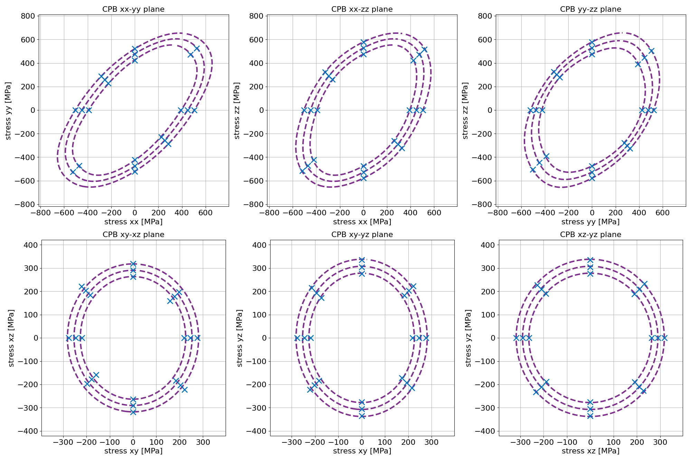

# Fitting Cazacu-Plunkett-Barlat yield surface

In this example, the Cazacu-Plunkett-Barlat (CPB) yield surface will be fitted with yielding data in multiple loading directions. The yielding data will be acquired by running the nesscecary DAMASK simulations. 

It will be assumed that the user provides a ready-to-use grid file (`Polycrystal_25_5x5x5.vti`), material properties file (`titanium_assigned.yaml`) and has a reasonable estimate for the yield strengths, see the example on [`uniaxial yield points`](yield_point.md) how to find this last requirement.

The overall steps will be:

- Creating a project and adding the settings
- Running the simulation
- Finding the results

## Creating the project

In this example, the project name is assumed to be `template_yield_surface`, the grid file to be located in the project folder as `input_files/Polycrystal_25_5x5x5.vti` and the material properties file in the project folder as `input_files/titanium_assigned.yaml`. 

Within the project folder, create the `problem_definition.yaml`. Add the following configuration:

```
general: 
    simulation_type     : yield_surface
    remove_damask_files_after_job_completion: True
    dimensions          : 3D
    material_properties : "input_files/titanium_assigned.yaml"
    grid_file           : "input_files/Polycrystal_25_5x5x5.vti"
    stress_tensor_type: "Cauchy"
    strain_tensor_type: "true_strain"
    postprocessing_only: False

yielding_condition:
    yield_condition: plastic_work
    plastic_strain_yield: 0.002
    modulus_degradation_percentage: 0.1
    plastic_work_threshold: 808647.5307
    estimated_tensile_yield: 600e6
    estimated_shear_yield: 350e6

solver:
    N_increments: 15
    cpu_cores: 0
    # The following settings are technical DAMASK settings
    stop_after_subsequent_parsing_errors: 20
    solver_type: "spectral_basic"
    N_staggered_iter_max: 10      
    N_cutback_max: 3        
    N_iter_min: 1            
    N_iter_max: 100         
    eps_abs_div_P: 1.0e-4            
    eps_rel_div_P: 5.0e-4            
    eps_abs_P: 1.0e3                  
    eps_rel_P: 1.0e-3                 
    eps_abs_curl_F: 1.0e-10          
    eps_rel_curl_F: 5.0e-4           

    simulation_time : 1000         
    monitor_update_cycle: 5    

yield_surface:   
    yield_criterion: Cazacu-Plunkett-Barlat
    bounds_CPB: [[0, 1],[0, 3], [1.5, None]]
    yield_stress_ref: 448.86e6

    stress_state_creation: automatic 

    # Automatic generation settings: 
    assume_tensile_compressive_symmetry: True
    load_points_per_quadrant: 2

    # Manual creation settings:
    stress_x_x: [ 650e6,      0,      0,     0,     0,     0]
    stress_x_y: [     0,      0,      0, 350e6,     0,     0]
    stress_x_z: [     0,      0,      0,     0, 350e6,     0]
    stress_y_y: [     0,  650e6,      0,     0,     0,     0]
    stress_y_z: [     0,      0,      0,     0,     0, 350e6]
    stress_z_z: [     0,      0,  650e6,     0,     0,     0]
```

**Change in yielding condition**

Bidirectional loading directions will be used for this simulation. The definition of 0.2% strain for yielding based on the stress-strain curve does not work for these load cases. Therefore the the yielding condition `plastic_work` will be used for this simulation:

- `yield_condition`: plastic_work

This condition also needs a threshold to define when yielding has occurred. The value is identified from a uniaxial yield test, where the amount of accumulated plastic work density at yielding is observed. The data can be extracted from the file `load_case_results`, recorded in the rightmost column:

```
      increment, stress_xx[MPa], stress_yy[MPa], stress_zz[MPa], stress_yz[MPa], stress_xz[MPa], stress_xy[MPa],      strain_xx,      strain_yy,      strain_zz,      strain_yz,      strain_xz,      strain_xy,       Wp[J/m3]
              0,           0.00,           0.00,           0.00,          -0.00,           0.00,           0.00,       0.000000,       0.000000,       0.000000,       0.000000,       0.000000,       0.000000,         0.0000
              1,          53.35,          -0.00,          -0.00,          -0.00,           0.00,          -0.00,       0.000473,      -0.000164,      -0.000144,      -0.000007,      -0.000001,      -0.000002,         0.0000
              2,         106.73,          -0.00,          -0.00,          -0.00,          -0.00,          -0.00,       0.000945,      -0.000328,      -0.000288,      -0.000014,      -0.000002,      -0.000005,         0.0004
              3,         160.15,           0.00,           0.01,           0.00,           0.00,           0.00,       0.001416,      -0.000491,      -0.000432,      -0.000021,      -0.000003,      -0.000007,         1.1764
              4,         213.59,          -0.00,          -0.00,          -0.00,          -0.00,          -0.00,       0.001888,      -0.000656,      -0.000576,      -0.000028,      -0.000005,      -0.000009,       352.3793
              5,         267.09,          -0.00,          -0.00,           0.00,           0.00,           0.00,       0.002398,      -0.000849,      -0.000732,      -0.000046,      -0.000004,      -0.000012,     14146.0645
              6,         320.68,           0.00,          -0.00,          -0.00,           0.00,          -0.00,       0.003106,      -0.001172,      -0.000955,      -0.000100,      -0.000010,      -0.000015,     99912.5391
              7,         374.44,           0.00,          -0.01,          -0.00,           0.00,          -0.00,       0.004105,      -0.001677,      -0.001288,      -0.000218,      -0.000031,      -0.000003,    298834.9301
              8,         428.40,           0.00,          -0.00,           0.00,          -0.00,          -0.00,       0.005354,      -0.002338,      -0.001716,      -0.000396,      -0.000083,       0.000024,    608303.8432
              9,         482.67,           0.00,           0.00,          -0.00,          -0.00,           0.00,       0.007014,      -0.003255,      -0.002301,      -0.000642,      -0.000200,       0.000060,   1139760.3514
             10,         537.64,           0.00,          -0.00,          -0.00,          -0.00,           0.00,       0.009655,      -0.004790,      -0.003248,      -0.001084,      -0.000419,       0.000055,   2253033.2093
             11,         593.97,          -0.01,           0.00,          -0.00,          -0.00,           0.00,       0.014155,      -0.007502,      -0.004872,      -0.001830,      -0.000850,      -0.000204,   4546869.2841
             12,         653.10,           0.01,          -0.00,           0.00,          -0.00,          -0.00,       0.022210,      -0.012514,      -0.007736,      -0.003165,      -0.001380,      -0.000873,   9283668.4896
             13,         718.42,           0.00,           0.00,           0.00,          -0.01,           0.00,       0.037764,      -0.022462,      -0.013076,      -0.006251,      -0.001740,      -0.002566,  19649774.0961
             14,         803.20,           0.01,           0.01,           0.00,          -0.00,           0.00,       0.076112,      -0.047404,      -0.025523,      -0.012009,      -0.002148,      -0.007846,  48826005.3833
     yieldpoint,         448.86,           0.00,          -0.00,          -0.00,          -0.00,          -0.00,       0.005980,      -0.002684,      -0.001937,      -0.000489,      -0.000127,       0.000038,    808647.5307
```

## Results

After all jobs and fitted are concluded, the results can be observed in the project folder. The fitted parameters are recorded in `Cazacu-Plunkett-Barlat.csv`:

```
        C_11,        C_12,        C_13,        C_14,        C_15,        C_16,        C_21,        C_22,        C_23,        C_24,        C_25,        C_26,        C_31,        C_32,        C_33,        C_34,        C_35,        C_36,        C_41,        C_42,        C_43,        C_44,        C_45,        C_46,        C_51,        C_52,        C_53,        C_54,        C_55,        C_56,        C_61,        C_62,        C_63,        C_64,        C_65,        C_66,           a,           k, unit_stress,         MSE
    0.177040,    1.813120,    0.936096,    0.000000,    0.000000,    0.000000,    1.813120,    0.796320,    0.435368,    0.000000,    0.000000,    0.000000,    0.936096,    0.435368,    1.821307,    0.000000,    0.000000,    0.000000,    0.000000,    0.000000,    0.000000,    1.166243,    0.000000,    0.000000,    0.000000,    0.000000,    0.000000,    0.000000,    1.235040,    0.000000,    0.000000,    0.000000,    0.000000,    0.000000,    0.000000,    1.416717,    3.059065,    0.000000,         MPa,   52.437968
```

The plotted contour of the yield surface is plotted in the different component planes in the file `Cazacu-Plunkett-Barlat.png`:


Note that the blue datapoints in the tensile half of the plot are based on actual simulations, while the red ones are deduced using the assumption of tensile-compressive symmetry.

## Fitting yield loci after pre-deformation

In order to fit a yield surface to the plastic onset of a microstructure that underwent a pre-deformation, the settings below can be used. Important additions and changes are `restart_file_path` and `history_loadcase_path` in the general settings and the change of `assume_tensile_compressive_symmetry` from `True` to `False`. Note that an unchanged amount of points per quadrant will lead to a doubled number of required simulations without the assumption of symmetry.

```
general: 
    simulation_type     : yield_surface
    remove_damask_files_after_job_completion: True
    dimensions          : 3D
    material_properties : "input_files/titanium_assigned.yaml"
    grid_file           : "input_files/Polycrystal_25_5x5x5.vti"
    stress_tensor_type: "Cauchy"
    strain_tensor_type: "true_strain"
    postprocessing_only: False

    restart_file_path: "input_files/template_preloading_restart.hdf5"
    history_loadcase_path:  "input_files/LOADCASE.yaml"

yielding_condition:
    yield_condition: plastic_work
    plastic_strain_yield: 0.002
    modulus_degradation_percentage: 0.1
    plastic_work_threshold: 808647.5307
    estimated_tensile_yield: 600e6
    estimated_shear_yield: 350e6

solver:
    N_increments: 15
    cpu_cores: 0
    # The following settings are technical DAMASK settings
    stop_after_subsequent_parsing_errors: 20
    solver_type: "spectral_basic"
    N_staggered_iter_max: 10      
    N_cutback_max: 3        
    N_iter_min: 1            
    N_iter_max: 100         
    eps_abs_div_P: 1.0e-4            
    eps_rel_div_P: 5.0e-4            
    eps_abs_P: 1.0e3                  
    eps_rel_P: 1.0e-3                 
    eps_abs_curl_F: 1.0e-10          
    eps_rel_curl_F: 5.0e-4           

    simulation_time : 1000         
    monitor_update_cycle: 5    

yield_surface:   
    yield_criterion: Cazacu-Plunkett-Barlat
    bounds_CPB: [[0, 1],[0, 3], [1.5, None]]
    yield_stress_ref: 448.86e6

    stress_state_creation: automatic 

    # Automatic generation settings: 
    assume_tensile_compressive_symmetry: False
    load_points_per_quadrant: 2

    # Manual creation settings:
    stress_x_x: [ 650e6,      0,      0,     0,     0,     0]
    stress_x_y: [     0,      0,      0, 350e6,     0,     0]
    stress_x_z: [     0,      0,      0,     0, 350e6,     0]
    stress_y_y: [     0,  650e6,      0,     0,     0,     0]
    stress_y_z: [     0,      0,      0,     0,     0, 350e6]
    stress_z_z: [     0,      0,  650e6,     0,     0,     0]
```

Results can be observed in files analogous to those of the previous analysis:

```
        C_11,        C_12,        C_13,        C_14,        C_15,        C_16,        C_21,        C_22,        C_23,        C_24,        C_25,        C_26,        C_31,        C_32,        C_33,        C_34,        C_35,        C_36,        C_41,        C_42,        C_43,        C_44,        C_45,        C_46,        C_51,        C_52,        C_53,        C_54,        C_55,        C_56,        C_61,        C_62,        C_63,        C_64,        C_65,        C_66,           a,           k, unit_stress,         MSE
    1.070181,    2.070981,    0.970012,    0.000000,    0.000000,    0.000000,    2.070981,    0.763178,    0.561522,    0.000000,    0.000000,    0.000000,    0.970012,    0.561522,    1.412155,    0.000000,    0.000000,    0.000000,    0.000000,    0.000000,    0.000000,    1.003310,    0.000000,    0.000000,    0.000000,    0.000000,    0.000000,    0.000000,    1.055135,    0.000000,    0.000000,    0.000000,    0.000000,    0.000000,    0.000000,    1.203475,    1.718533,    0.183448,         MPa,   68.297671
```


Note that there are no red datapoints, as all datapoints are based on actual simulations and deduced from the assumption of symmetry of tension and compression.

### Comparison of yield surfaces

Using the standalone script `fit_yield_surface_and_plot.py`, two yield surfaces can be compared visually (which is demonstrated with a set of two yield loci unrelated to this example):


### Evolution of yield surfaces

Using the `postprocessing_only` flag, the same set of Damask output (HDF5) files, can be evaluated for yielding at different thresholds. The resulting yield points and fitted yield functions can also be visualized using `fit_yield_surface_and_plot.py`, with the `mode` flag in `compare_results/visualization_settings.yaml` set to `evolution` as opposed to `comparison`:


